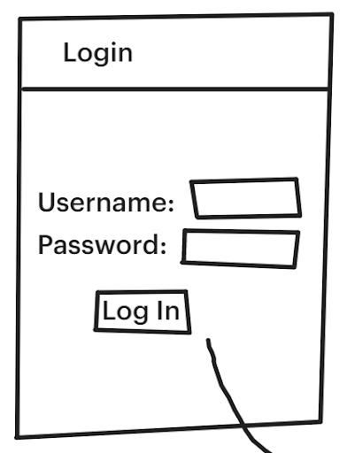
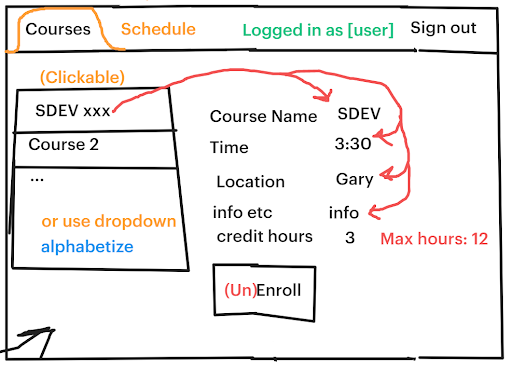
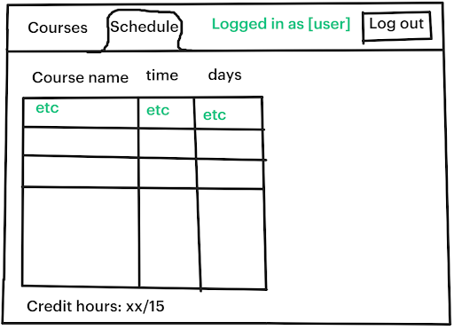

# SDEV 220 Team 2 Final Project
Authors: Yahya Alrobaie, Gunnar Dahl, Alvin Hampton, Shanika Person

### Purpose 
To allow users to view and enroll in college courses

### Userbase 
Students of some university

## Features
- Login window that authenticates users
- Course tab that allows the user to view and select courses to enroll in
- Schedule tab that allows the user to view the courses they are enrolled in
- Each user's schedule is persistant across sessions

## GUI Sketches

  
  
  

